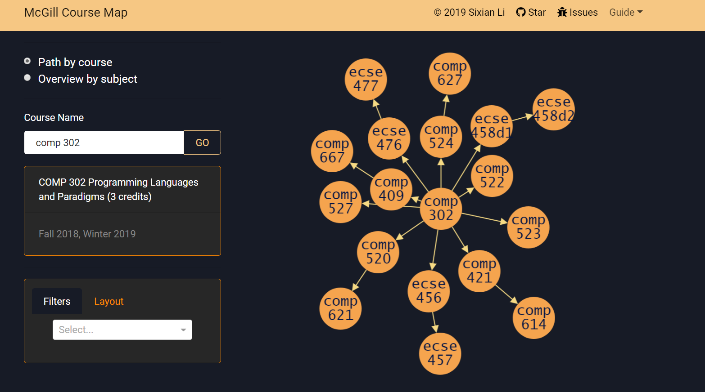
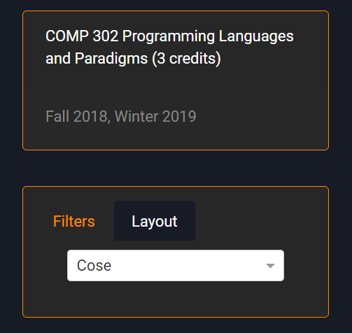
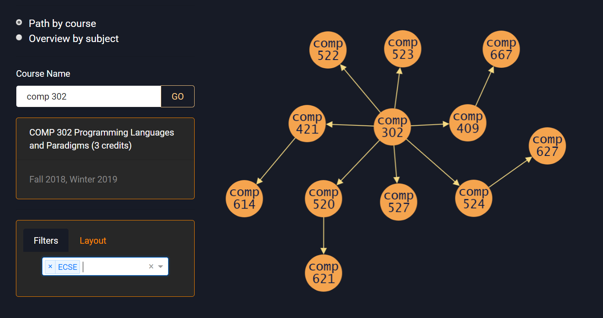
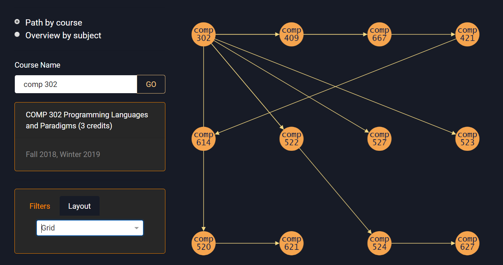
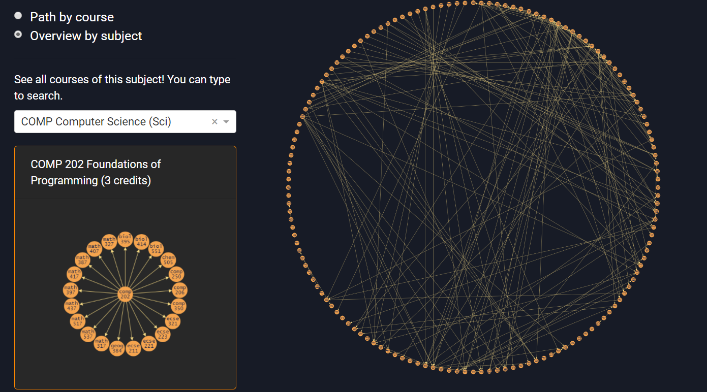
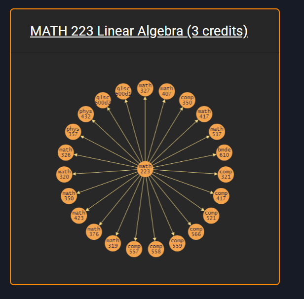
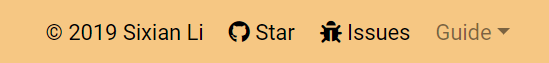

# McGill Course Map

## Find your path easily

### Features

People's interests vary, so do their degree paths.

McGill's website only shows what are prerequisites for a course but not where you can go after it. For those who are unsure about their future paths like me, possibilities matter. McGill Course Map comes to your aid.

It shows relationships between courses, so you can see all courses stemming from the one you are currently taking with information about term.

### Guide

**Path mode** 

shows all courses stemming from the one you search in the "Course Name" input box.

**Course info panel** provides the full name, credits, and terms offered of the one you clicked in the graph. You can go to the original page by clicking its name.

**Filters** filter out courses from certain subjects.

**Layout** changes the layout of nodes in the graph.

Examples:

**Overview mode**

It shows all courses from the subject you search. You can also see courses from other subjects that are relevant. For example, math 223 is a prerequisite for a lot of comp courses.

**Mini-map** shows which courses you can take JUST after the one you clicked. It's a breadth-first-search with depth limit 1. You can also go to the original page by clicking its name.

 

Author, link to the GitHub page, link to the GitHub issues page, and the detailed guide can be found in the navigation bar.

### How to run this app locally

1. `git clone https://github.com/Deerhound579/mcgill-course-map.git`
2. Create a virtual environment with Python 3.7.3 or higher. I recommend following this [Pyenv tutorial](https://realpython.com/intro-to-pyenv/#using-the-pyenv-installer) to manage your Python versions and set up the env.
3. `pip install -r requirements.txt` installs all dependencies
4. `python app.py`

### License

Copyright © Sixian Li. 

McGill is a University in Montreal and has no affiliation with this software.

This software is under GNU General Public License v3.0. More info can be found in the [LICENSE](<https://github.com/Deerhound579/mcgill-course-map/blob/master/LICENSE>) file.

